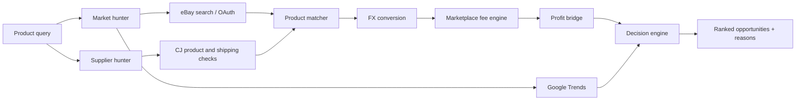

# AI Drop Agent

> A research and decision-support pipeline for finding product opportunities, matching suppliers, checking marketplace economics, and ranking opportunities with explicit uncertainty.

<p align="center">
  <a href="https://github.com/Vahid-Rahmani/AI-Drop-Agent"></a>
  <a href="https://www.python.org/"></a>
  <a href="https://langchain-ai.github.io/langgraph/"></a>
</p>

## What it does

AI Drop Agent is organised as a set of small, testable services rather than a single opaque automation script. It searches market signals, checks supplier information, matches products, converts currencies, calculates known fees, and produces an opportunity result that can be reviewed before any commercial action is taken.

## Decision pipeline



## Current modules

| Module | Responsibility |
| --- | --- |
| `market_hunter` | Market search, eBay integration, OAuth token lifecycle and trend signals |
| `supplier_hunter` | CJ product lookup, supplier checks and shipping information |
| `product_matcher` | Normalises and compares market/supplier products |
| `fx` | Currency provider and conversion layer |
| `fees` | Explicit marketplace fee calculations and unknown-fee safeguards |
| `profit_engine` | Connects costs, fees, revenue and profit eligibility |
| `decision_engine` | Applies ranking and decision rules |
| `opportunity_hunter` | Composes the end-to-end LangGraph workflow |

## Principles

- Research support, not unattended store publishing.
- Unknown or stale fee data blocks a profit claim instead of being guessed.
- API credentials and OAuth tokens stay outside source control.
- External responses are normalised before they enter the decision layer.
- Every result should expose enough context to be reviewed by a human.

## Local setup

Requirements: Python 3.11+ and a virtual environment.

```bash
git clone https://github.com/Vahid-Rahmani/AI-Drop-Agent.git
cd AI-Drop-Agent
python -m venv .venv
# Windows PowerShell
.\.venv\Scripts\Activate.ps1
pip install -r requirements.txt
```

Copy `.env.example` to `.env` when the project provides the template, then add only the credentials needed for the integrations you intend to use. Never commit `.env`, OAuth token files, or runtime secrets.

## Running checks

```bash
python -m unittest discover -s tests -p "test_*.py"
```

The repository is under active development. Check the source modules and tests for the currently supported command-line entry points before connecting live marketplace accounts.

## Safety and production boundary

This project does not guarantee product demand, supplier quality, delivery time, marketplace approval, taxes, or profit. Validate prices, fees, fulfilment, legal requirements, returns, and platform policies independently before making a business decision.

## Roadmap

- [x] Modular market, supplier, matching, FX, fee and decision layers
- [x] Explicit handling for unknown eBay fee inputs
- [x] eBay OAuth token lifecycle foundation
- [ ] Persistent opportunity reports
- [ ] Provider contract tests with safe fixtures
- [ ] Human review queue and exportable decision reports
- [ ] Deployment and observability documentation

## Links

- [GitHub profile](https://github.com/Vahid-Rahmani)
- [Portfolio](https://vahid-portfolio-three.vercel.app/)
