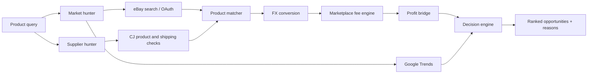

# AI Drop Agent

> A simulation-first, auditable dropshipping operating core for the German market.

<p align="center">
  <a href="https://github.com/Vahid-Rahmani/AI-Drop-Agent"></a>
  <a href="https://www.python.org/"></a>
  <a href="https://langchain-ai.github.io/langgraph/"></a>
</p>

## What it does

AI Drop Agent is organised as small, testable services rather than an opaque automation script. It searches market signals, checks supplier information, matches products, converts currencies, calculates known fees, applies deterministic policy gates, creates grounded drafts, simulates an order lifecycle, and produces an auditable business review.

## Decision pipeline



## Current modules

| Module | Responsibility |
| --- | --- |
| `market_hunter` | Market search, eBay integration, OAuth token lifecycle and trend signals |
| `supplier_hunter` | CJ product lookup, supplier checks and shipping information |
| `product_matcher` | Normalises and compares market/supplier products |
| `fx` | Currency provider and conversion layer |
| `fees` | Explicit marketplace fee calculations and unknown-fee safeguards |
| `profit_engine` | Connects costs, fees, revenue and profit eligibility |
| `decision_engine` | Applies ranking and decision rules |
| `opportunity_hunter` | Composes the end-to-end LangGraph workflow |
| `core` | Policy engine, audit log, deterministic economics, provider boundary, and order state machine |
| `agents` | Specialist agents for research, suppliers, matching, compliance, listing, marketing, support, and analytics |
| `workflows` | End-to-end simulation with no real spend, supplier orders, or marketplace writes |
| `api` / `brain` | FastAPI control surface and central orchestration boundary |

## Principles

- Research support, not unattended store publishing.
- Unknown or stale fee data blocks a profit claim instead of being guessed.
- API credentials and OAuth tokens stay outside source control.
- External responses are normalised before they enter the decision layer.
- Every result should expose enough context to be reviewed by a human.
- High-impact actions remain approval-gated; the model cannot override policy code.
- Simulation is the default and does not require credentials.

## Local setup

Requirements: Python 3.11+ and a virtual environment.

```bash
git clone https://github.com/Vahid-Rahmani/AI-Drop-Agent.git
cd AI-Drop-Agent
python -m venv .venv
# Windows PowerShell
.\.venv\Scripts\Activate.ps1
pip install -r requirements.txt
```

Copy `.env.example` to `.env` when the project provides the template, then add only the credentials needed for the integrations you intend to use. Never commit `.env`, OAuth token files, or runtime secrets.

## Run the simulation

```bash
drop-agent-sim --query hoodie
# or
uvicorn app.main:app --reload
```

Then open `http://localhost:8000/docs` and call `POST /simulate`.

## Running checks

```bash
python -m pytest -q
python -m ruff check app tests
```

The repository is under active development. Check the source modules and tests for the currently supported command-line entry points before connecting live marketplace accounts.

## Safety and production boundary

This project does not guarantee product demand, supplier quality, delivery time, marketplace approval, taxes, returns, or profit. Live eBay/CJ operations require approved accounts, a managed PostgreSQL deployment, secret-manager provisioning, sandbox checks, and a human-reviewed canary. Validate prices, fees, fulfilment, legal requirements, returns, and platform policies independently.

## Roadmap

- [x] Modular market, supplier, matching, FX, fee and decision layers
- [x] Explicit handling for unknown eBay fee inputs
- [x] eBay OAuth token lifecycle foundation
- [x] Deterministic economics, policy gates, audit events, and order state machine
- [x] End-to-end simulation and API surface
- [x] OpenAI-compatible/local provider boundary with deterministic mock provider
- [x] Project state, implementation status, safety, operations, and local-model documentation
- [x] SQLite/PostgreSQL durable stores, authenticated control plane, RBAC, signed webhooks, redaction, and readiness validation
- [x] Fixture-tested eBay/CJ marketplace and supplier adapters with approval/idempotency boundaries

## Live activation boundary

The repository is `BLOCKED_EXTERNAL_ONLY`: all code-controlled production paths are implemented and tested. The remaining steps are external provisioning and review—managed PostgreSQL, secret manager, eBay/CJ account approvals and credentials, account-specific fee/tax verification, and a production canary.

## Links

- [GitHub profile](https://github.com/Vahid-Rahmani)
- [Portfolio](https://vahid-portfolio-three.vercel.app/)
